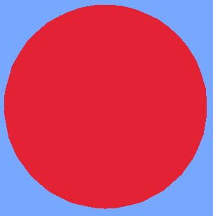

# World renderer

## `renderFilled(box, red, green, blue, alpha, throughWalls)`

Draws a 3D filled block.

**Returns:**

* (boolean) Return true if successfully

**Example Usage:**

```lua
-- Example code showing how to use the function
local creator = require("creator")
local box = creator.createBox(0, 0, 0, 1, 1, 1)
registerWorldRenderer(function(context)
	context.renderFilled(box, 255, 0, 0, 0, 170, true)
end)
```
<figure><figcaption></figcaption></figure>

## `renderOutline(box, red, green, blue, alpha, lineWidth, throughWalls)`

Draws a 3D outlined block.

**Returns:**

* (boolean) Return true if successfully

**Example Usage:**

```lua
-- Example code showing how to use the function
local creator = require("creator")
local box = creator.createBox(0, 0, 0, 1, 1, 1)
registerWorldRenderer(function(context)
    context.renderOutline(box, 255, 0, 0, 0, 170, true)
end)
```

<figure><figcaption></figcaption></figure>

## `renderText(x, y, z, text, scale, throughWalls, red, green, blue, qx, qy, qz, qw)`

Draws a 3D text.

**Parameters:**

* `object` (table (x, y, z, red, green, blue, text, scale, through\_walls))

**Returns:**

* (boolean) Return true if successfully

**Example Usage:**

```lua
-- Example code showing how to use the function
registerWorldRenderer(function(context)
    context.renderText(args)
end)
```

<figure><figcaption></figcaption></figure>

## `renderLinesFromPoints(points, red, green, blue, alpha, lineWidth, throughWalls)`

Draws a 3D line.

**Parameters:**

* `object` (table (red, green, blue, points))

**Returns:**

* (boolean) Return true if successfully

**Example Usage:**

```lua
-- Example code showing how to use the function
registerWorldRenderer(function(context)
    context.renderLinesFromPoints(args)
end)
```

<figure><figcaption></figcaption></figure>

## `renderLineFromCursor(x, y, z, red, green, blue, alpha, lineWidth)`

Draws a 3D line from cursor.

**Parameters:**

* `object` (table (x, y, z, line\_width, red, green, blue))

**Returns:**

* (boolean) Return true if successfully

**Example Usage:**

```lua
-- Example code showing how to use the function
registerWorldRenderer(function(context)
    context.renderLineFromCursor(args)
end)
```

<figure><figcaption></figcaption></figure>

`renderImage(path, x, y, z, width, height, regionWidth, regionHeight, offsetX, offsetY, offsetZ,`\
`red, green, blue, alpha, throughWalls)`
----------------------------------------

Draws a 3D line from cursor.

**Parameters:**

* `object` (table (x, y, z, red, green, blue))

**Returns:**

* (boolean) Return true if successfully

**Example Usage:**

```lua
-- Example code showing how to use the function
registerWorldRenderer(function(context)
	context.renderImage(args)
end)
```

<figure><figcaption></figcaption></figure>

## `renderBeaconBeam(x, y, z, red, green, blue)`

Draws a 3D beacon beam.

**Parameters:**

* `object` (table (x, y, z, red, green, blue))

**Returns:**

* (boolean) Return true if successfully

**Example Usage:**

```lua
-- Example code showing how to use the function
registerWorldRenderer(function(context)
	context.renderBeaconBeam(args)
end)
```

<figure><figcaption></figcaption></figure>

## `renderOutlineCircle(x, y, z, radius, segments, thickness, red, green, blue, alpha, throughWalls)`

Draws a 3D outlined circle.

**Parameters:**

* `object` (table (x, y, z, red, green, blue, alpha, radius, segments, through\_walls, line\_width))

**Returns:**

* (boolean) Return true if successfully

**Example Usage:**

```lua
-- Example code showing how to use the function
registerWorldRenderer(function(context)
    context.renderOutlineCircle(args)
end)
```

<figure><figcaption></figcaption></figure>

## `renderFilledCircle(x, y, z, radius, segments, red, green, blue, alpha, throughWalls)`

Draws a 3D outlined circle.

**Parameters:**

* `object` (table (x, y, z, red, green, blue, alpha, radius, segments, through\_walls))

**Returns:**

* (boolean) Return true if successfully

**Example Usage:**

```lua
-- Example code showing how to use the function
registerWorldRenderer(function(context)
    context.renderFilledCircle(args)
end)
```

<figure><figcaption></figcaption></figure>

## `renderCylinder(x, y, z, radius, height, segments, red, green, blue, alpha, throughWalls)`

Draws a 3D cylinder.

**Parameters:**

* `object` (table (x, y, z, red, green, blue, alpha, radius, height, segments, through\_walls))

**Returns:**

* (boolean) Return true if successfully

**Example Usage:**

```lua
-- Example code showing how to use the function
registerWorldRenderer(function(context)
    context.renderCylinder(args)
end)
```

<figure><figcaption></figcaption></figure>

## `renderSphere(x, y, z, radius, segments, rings, red, green, blue, alpha, throughWalls)`

Draws a 3D sphere.

**Returns:**

* (boolean) Return true if successfully

**Example Usage:**

```lua
-- Example code showing how to use the function
registerWorldRenderer(function(context)
    context.renderSphere(args)
end)
```

<figure><figcaption></figcaption></figure>

## `renderHologramBlock(x, y, z, id)`

Draws a 3D opacity block.

**Returns:**

* (boolean) Return true if successfully

**Example Usage:**

```lua-- Example code showing how to use the function
registerWorldRenderer(function(context)
    context.renderHologramBlock(0, 160, 0, 1)
end)
```

<figure><figcaption></figcaption></figure>

## `renderBlock(x, y, z, id)`

Draws a 3D opacity block.

**Parameters:**

* `object` (table (x, y, z, id))

**Returns:**

* (boolean) Return true if successfully

**Example Usage:**

```lua
-- Example code showing how to use the function
registerWorldRenderer(function(context)
    context.renderBlock(0, 160, 0, 1)
end)
```

<figure><figcaption></figcaption></figure>
